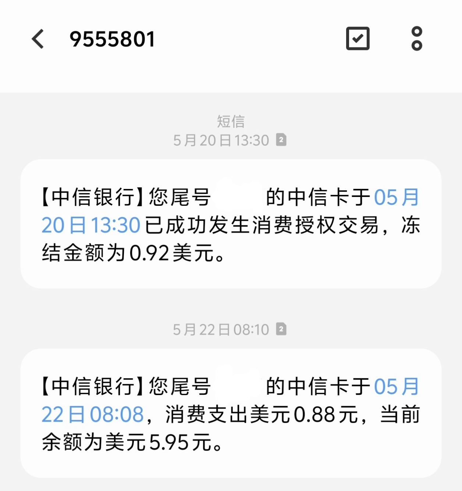

&ensp;&ensp;去年5月15日中信银行发行了这张万事达双币借记卡，当天上午我就在手机银行上申请了这张卡片，博主是学生，申请不了信用卡，之前就一直想拥有一张外币卡能够在国外网站、谷歌商店上支付。这张卡片申请时需要支付5块的工本费（中信的卡申请一般都要工本费，激活后会退到卡片），线上办到的是金卡，没有门槛，卡BIN是522401，16位卡号规则：卡BIN6位+地区码2位+后面8位数组成。 
&ensp;&ensp;卡申请了快二十天才发货，我收到了就去了市分行激活，激活没有什么刁难，大堂经理看我是学生只给开二类，但限额也给了默认二类的日一万，年二十万。这限额对我来说已经够用了，虽然是二类卡，别的银行二类卡无法购汇，但是中信的卡却可以购汇，这一点非常好。这张卡有人民币账户，可以绑定微信支付宝消费，消费美元需要手动购汇，目前不会自动换汇，美元授权交易冻结比例为105%，也可以购汇存入其他币种消费。 

&ensp;&ensp;后续的使用体验：中信的卡经常被人称为拒付王，但在我使用体验了之后，没有出现拒付的情况，能够正常绑定Steam、Play商店、饭盒(Fanbox)、Spaceship域名购买、AWS绑卡验证、国际服游戏充值等，有时也能触发3DS验证成功支付。 
&ensp;&ensp;总的来说，中信的这张万事达双币借记卡是符合我预期的，能够满足我的支付需求。以上就是国内发行的外币借记卡使用体验，像之后发行的邮储、广发、招商的新万事达借记卡就暂不体验了，毕竟现在去银行办理激活一张卡也有一些刁难的，毕竟银行工作人员也不容易，各位也保管好自己的卡片，不出租出借他人使用，谨防诈骗。

详情页面：[中信银行万事达双币借记卡介绍页](https://wap.bank.ecitic.com/NMBFOServer/MobileBankWeb/?index=SmartCube.PageNoHeader&pageId=5251)
